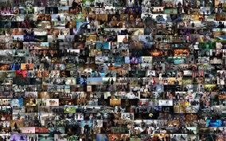

# MOVIE-RECOMMENDER SYSTEM

<!--  -->
<div align="center">
  
</div>

<u> Objective </u>

Our objective is to build a production-quality movie recommendation pipeline which provides a personalizied  5 top list of movies specific to each users. The goal of this new pipeline is to increase user retention for the platform and provide a better experience.

 <u>Data Source </u>

We will be using a[dataset](https://grouplens.org/datasets/movielens/latest/) from the GroupLens research lab at the University of Minnesota 

The dataset is compressed into `ml-latest.tar.gz`. 
To extract it, run:
```bash 
tar -xvzf ml-latest.tar.gz

<u>Installations</u>

1. Clone the repository:
   ```bash
   git clone https://github.com/your-username/your-repo.git

2.Navigate to the project Directory
  ```bash
  cd your-repo

3.Install the required dependencies
   ```bash
   pip install -r requirements.txt

<u> Usage </u>

1.Preprocess the data
   ```bash
   python src/data_processing.py

2.Train the reccommendation Model
   ```bash
   python src/model_training.py

3.Generate Movie Recommendation for user 
   ```bash
   python src/recommender.py --user_id <USER_ID>

<u>Dependencies </u>

Install the python packages enlisted in the requirements.txt
   To install them run:
      ```bash
      pip install -r requirements.txt


<u>Contributing</u>

If you`d like to contribute please follow the following steps:
   1. Fork the repository
   2. Create a new branch
   3. Commit your changes
   4. Submit a pull request


<u>Contacts </u>

For questions or feedback.kindly reach out:

   - <b>Email:</b>mulwajose.jm@gmail.com
   - <b><Github:</b><a href="/https://github.com/Mulwajoseph">Github</a>